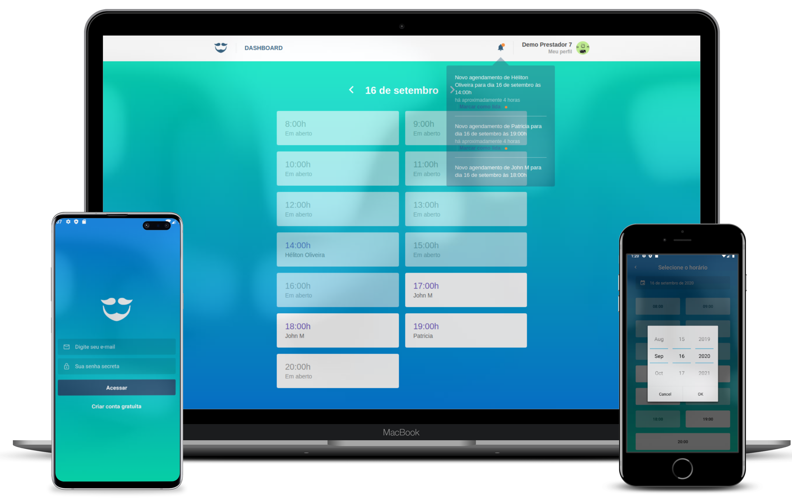

<h1 align="center">
  
</h1>

<h2 align="center">GoBarber</h2>


<p align="center">
  

  <a href="https://www.linkedin.com/in/helitonoliveira/">
    
  </a>

  

  <a href="https://github.com/heliton1988/gobarber/stargazers">
    
  </a>
</p>

<p align="center">
  <a href="#rocket-sobre">Sobre</a>&nbsp;&nbsp;&nbsp;|&nbsp;&nbsp;&nbsp;
  <a href="#dizzy-funcionalidades">Funcionalidades</a>&nbsp;&nbsp;&nbsp;|&nbsp;&nbsp;&nbsp;
  <a href="#arrowdown-como-clonar-o-projeto">Baixe o projeto</a>&nbsp;&nbsp;&nbsp;|&nbsp;&nbsp;&nbsp;
  <a href="#pagefacingup-licença">Licença</a>
</p>

<p align="center">
  
</p>

# :rocket: Sobre

O GoBarber é uma aplicação completa, incluindo back-end, front-end e mobile. É uma aplicação que tem foco em gerenciar serviços de beleza como agendamentos, notificações, cadastramento de usuários.<br /> 
Também é possível gerenciar perfis tanto dos prestadores de serviços como também do usuário final`(cliente)`.<br /><br />

Esta aplicação foi desenvolvida em paralelo com as aulas do [Bootcamp GoStack Rocketseat](https://rocketseat.com.br/), onde o intuito foi praticar e massificar os conteúdos aprendidos durante o curso.

## :dizzy: Funcionalidades

O usuário paderá se autenticar na aplicação sendo ele um usuário comum ou um prestador de serviço(provider).<br />
Após estar logado na aplicação, o provider pode verificar todos os seus agenamentos do dia ou uma data expecífica.<br />
Sempre que um usuário(cliente) fizer um novo agendamento, o provider será notificado, tanto pela aplicaçaão web como também atravez do seus e-mail.

O usuário(não provedor) da aplicação também pode realizar auteração em seu perfil na aplicação, como nome, email e senha, também é possível cancelar agendamentos.

## :arrow_down: Como clonar o projeto

**Observação:**
é necessário ter o [Git](https://git-scm.com/) instalado e configuração em seu compudador

Via terminal navegue até o diretório onde deseja baixar o projeto.

```bash
# clone o repositório
$ git clone git@github.com:heliton1988/gobarber.git
```

Com o projeto já clonado, acesse a pasta do projeto.

```bash
$ cd gobarber
```
Dentro da pasta `gobarber` há mais 3 pastas; `backend`, `web` e `mobile`.
Agora será necessário acessar cada uma dessas pastas para baixar todas as dependências do projeto, como o exemplo abaixo;

```bash
# atualizando dependências do back-end
$ cd backend
$ yarn 
```

```bash
# atualizando dependências do front-end web
$ cd web
$ yarn 
```

```bash
# atualizando dependências do mobile
$ cd mobile
$ yarn 
```

Agora, com todas as dependência já baixadas e atualizadas, e hora de preparar e configurar o ambiente para rodar o back-end da aplicação.<br />
Você pode seguir o passo a passo no link a seguir...
[Clique aqui](https://github.com/heliton1988/gobarber/tree/master/backend) :rewind:
<br /><br />

Para informações de como configurar e rodar o projeto mobile [Clique aqui](https://github.com/heliton1988/gobarber/tree/master/web) 💻
<br /><br />

Para informações de como configurar e rodar o projeto mobile [Clique aqui](https://github.com/heliton1988/gobarber/tree/master/mobile) :iphone:
<br /><br />

## :page_facing_up: Licença
Esse projeto está sob a licença MIT. Veja o arquivo [LICENSE](https://github.com/heliton1988/gobarber/blob/master/LICENSE) para mais detalhes.

<br /><br />

<p align="center">Feito com 💚 by <a href="https://www.linkedin.com/in/helitonoliveira/" target="_blank">Héliton Oliveira</a></p>