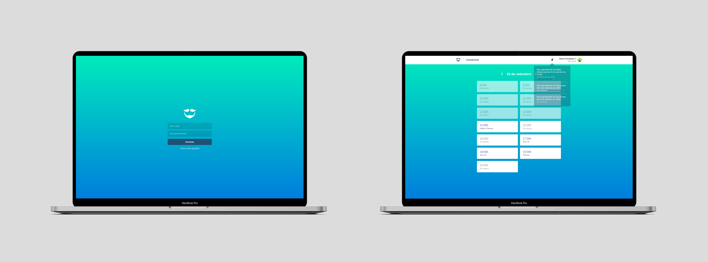

<h1 align="center">GoBarber Web</h1>

  

  

  

  

  

## :memo: Sobre

O GoBarber é uma aplicação que foi desenvolvida no decorrer do Bootcamp GoStack da Rocketseat, focada em agendamentos de serviços de beleza.  

É uma aplicação dedicada a o provedor de serviços, onde ele é obrigatóriamente gadastrado e tem acesso a todas as funcionalidades da aplicação, como listar e conferir seus agendamentos, visualizar quem são os outros providers...  

## :wrench: Ferramentas utilizadas

- [ReactJS](https://pt-br.reactjs.org/)
- [Redux](https://redux.js.org/)
- [Redux-Saga](https://redux-saga.js.org/)
- [Styled Components](https://styled-components.com/)
- [React-Toastify](https://github.com/fkhadra/react-toastify)
- [Polished](https://polished.js.org/)
- [React-Icons](https://react-icons.github.io/react-icons/)
- [Immer](https://immerjs.github.io/immer/docs/introduction)
- [Axios](https://github.com/axios/axios)

## :page_facing_up: Licença
Esse projeto está sob a licença MIT. Veja o arquivo [LICENSE](https://github.com/rocketseat-education/bootcamp-gostack-desafio-07/blob/master/LICENSE.md) para mais detalhes.

Feito com 💙 by [Héliton Oliveira](https://www.linkedin.com/in/helitonoliveira/) 👋 !!!
